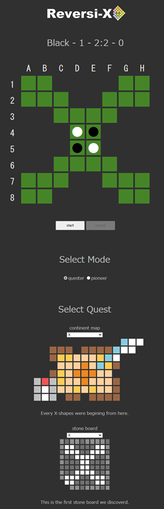
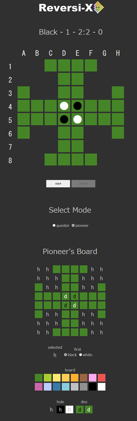
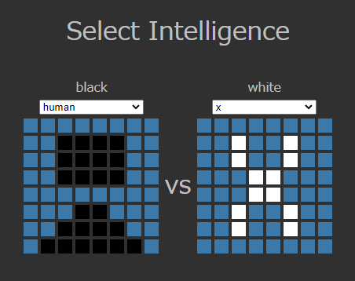

# 
Let's discover unknown reversi boards.

https://y-tetsu.github.io/reversi-x/

## Quester Mode
Select the continent map and stone board and press the start button to start the game.

Please play with your favorite board.

## Pioneer Mode
Play with the pioneer's board by freely drawing the shape and color of the board and the arrangement of discs.

## About Intelligence
Select "human" for human operation. In other cases, the computer operates.

