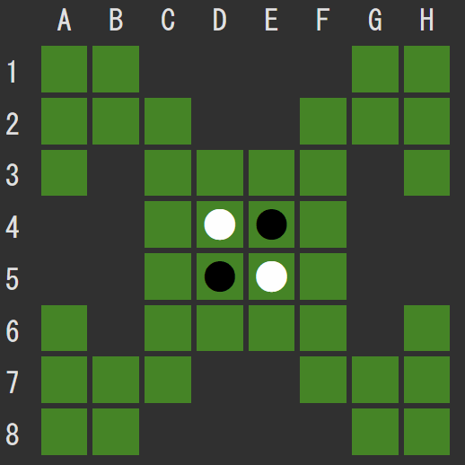
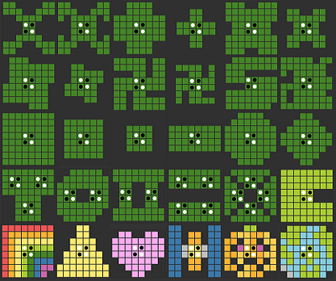

# 
**Reversi-X** is a browser game of reversi(othello) played on various boards.  There is also a mode where you can make your own board. The game is available on the following GitHub Pages, so please feel free to play!

https://y-tetsu.github.io/reversi-x/

## Quester Mode
Select the continent map and stone board and press the start button to start the game.

Please play with your favorite board.

## Pioneer Mode
Play with the pioneer's board by freely drawing the shape and color of the board and the arrangement of discs.

## About Intelligence
Select "human" for human operation. In other cases, the computer operates. You can play against the computer or your friends. You can also watch the computers play against each other.

